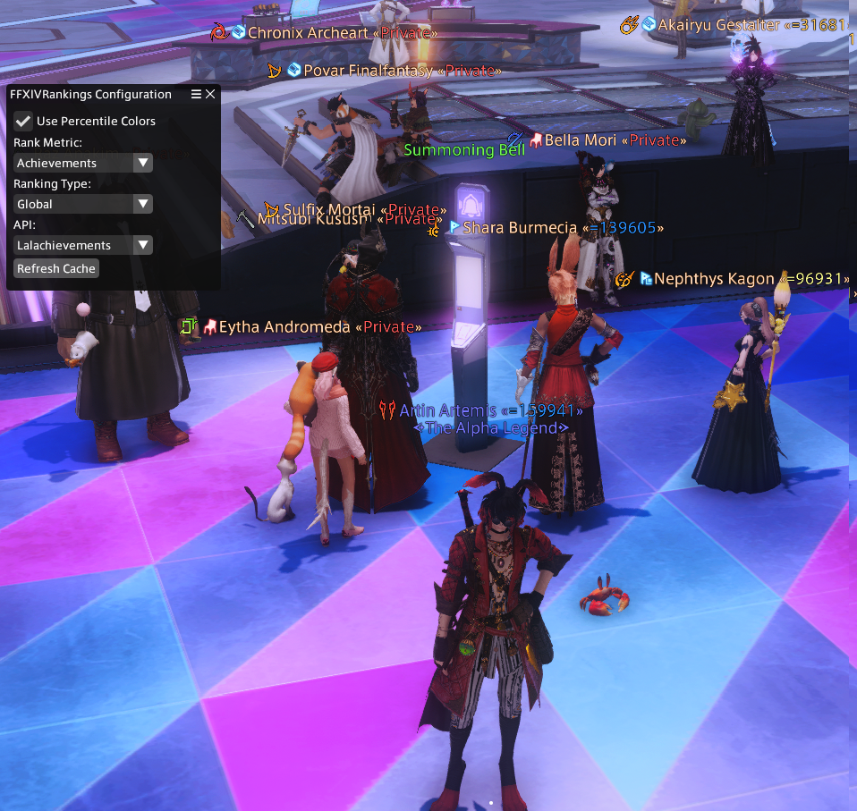

# FFXIVRankings

Displays the global numeric rank of a player on their nameplate.

Configure ranking by:
1. Achievements
2. Mounts
3. Minions

Ranks are based on community tools APIs and are configurable in the settings.

Use `/fcr` to toggle the display of the rankings.

> This plugin pairs well with: https://github.com/GitPaulo/RightClickSearchInfo

### Installation through `https://raw.githubusercontent.com/GitPaulo/FFXIVRankings/master/repo.json`
