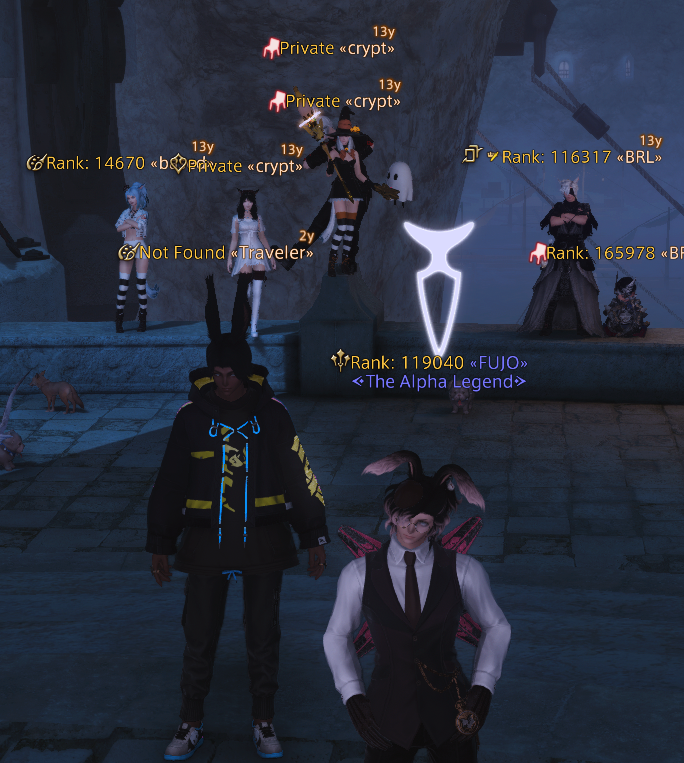

# FFXIVCollectRankings

Toggles the display of the FFXIV Collect rankings on the nameplate of a player.

Configure ranking by:
1. Achievements
2. Mounts
3. Minions

Use `/fcr` to toggle the display of the rankings.

> This plugin pairs well with: https://github.com/GitPaulo/RightClickSearchInfo

### Installation through https://raw.githubusercontent.com/GitPaulo/FFXIVCollectRankings/TODO

### TODO

- [ ] Improve performance during fetches in populated areas
- [ ] Finish configuration
- [ ] ...
